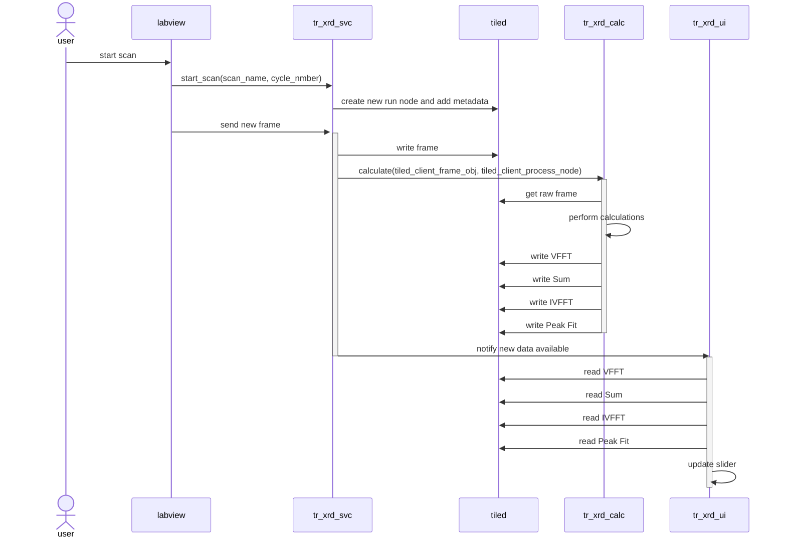
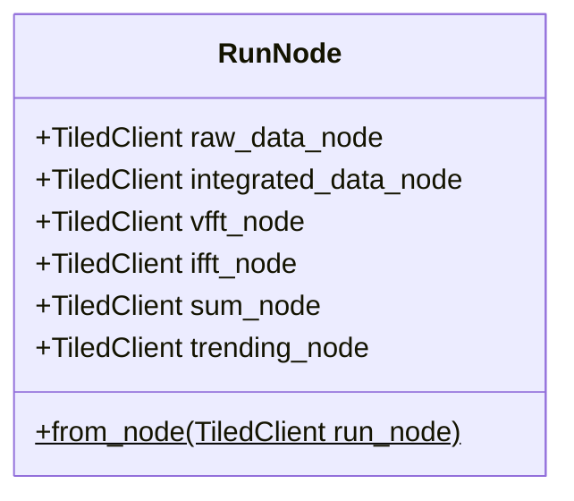

# Design

## Experiment Monitoring
System design notes for supporting the [Experiment Monitoring](./user_strories.md#experiment-monitoring) user story.

### Sequence Diagram

```mermaid

sequenceDiagram
    actor user
    user ->> labview: start scan
    labview ->> tr_xrd_svc: start_scan(scan_name, cycle_nmber)
    tr_xrd_svc ->> tiled: create new run node and add metadata
    labview ->>+ tr_xrd_svc: send new frame

    activate tr_xrd_svc
    tr_xrd_svc ->> tiled: write frame
    tr_xrd_svc ->> tr_xrd_calc: calculate(tiled_client_frame_obj, tiled_client_process_node)

    activate tr_xrd_calc
    tr_xrd_calc ->> tiled: get raw frame
    tr_xrd_calc ->> tr_xrd_calc: perform calculations
    tr_xrd_calc ->> tiled: write VFFT
    tr_xrd_calc ->> tiled: write Sum
    tr_xrd_calc ->> tiled: write IVFFT
    tr_xrd_calc ->> tiled: write Peak Fit
    deactivate tr_xrd_calc

    tr_xrd_svc ->> tr_xrd_ui: notify new data available
    deactivate tr_xrd_svc
    activate tr_xrd_ui
    tr_xrd_ui ->> tiled: read VFFT
    tr_xrd_ui ->> tiled: read Sum
    tr_xrd_ui ->> tiled: read IVFFT
    tr_xrd_ui ->> tiled: read Peak Fit
    tr_xrd_ui ->> tr_xrd_ui: update slider
    deactivate tr_xrd_ui
```

### Classes

```mermaid
classDiagram

    class RunNode{
        +TiledClient raw_data_node
        +TiledClient integrated_data_node
        +TiledClient vfft_node
        +TiledClient ifft_node
        +TiledClient sum_node
        +TiledClient trending_node

        +from_node(TiledClient run_node)$
    }

```
